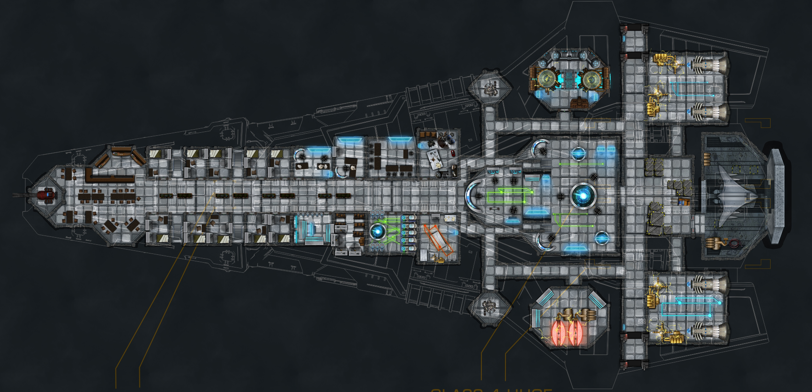
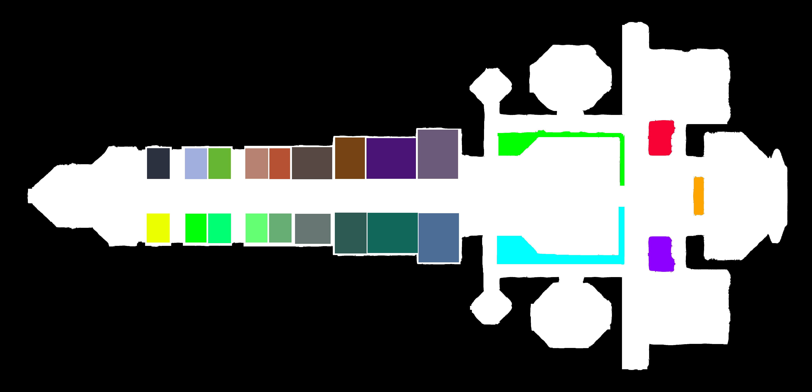

# Overview
FoundryVTTWallmaker is a Julia script that draws walls for Foundry Virtual Tabletop from a source image. The main goal was to facilitate using image manipulation software to draw walls instead of Foundry's editor.

# Example

Consider this map of a star destroyer.



Using a tool like Photoshop or GIMP, create a mask filling each area that needs to be surrounded with a wall. Black is reserved for the background color.



The script requires a FoundryVTT Scene JSON file to use as a base. See *Importing from JSON files* under *Importing Pre-configured Scenes* at https://foundryvtt.com/article/scenes/ for details. Running the script will create a new copy of the JSON file with the walls added.

```
julia FoundryVTTWallmaker.jl ship_wall_mask.png ship_scene.json.
```

By default, output will be a new JSON with `with_walls` tacked on the end though this can be changed with the `-o` option. Import the new JSON into Foundry to load the walls.

# Usage Notes
* For now, the script removes any map padding. Just add it back in if you need it for now.
* The script only does basic walls. You'll need to change the wall type in Foundry if you want something else.
* Create your image with anti-aliasing disabled. The script breaks the scene up into discrete colors. Additional colors added from anti-aliasing will produce undesirable effects.
* Use the `--help` command for more information on options if the walls need to be tweaked.